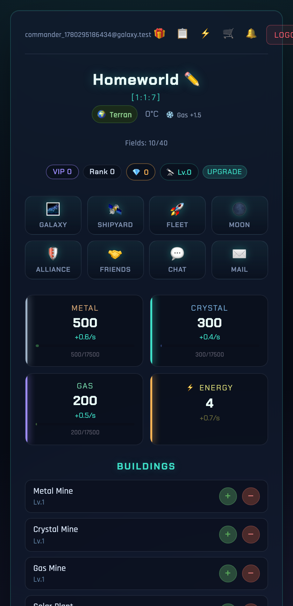
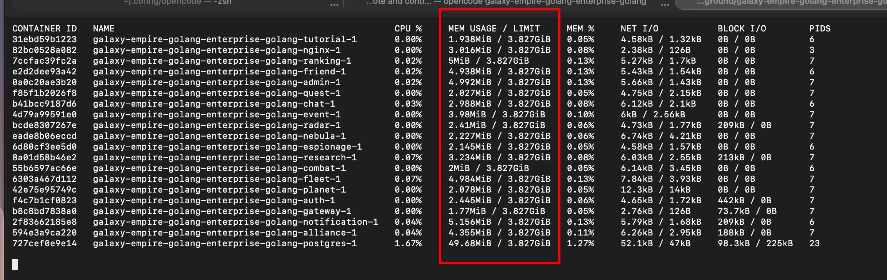
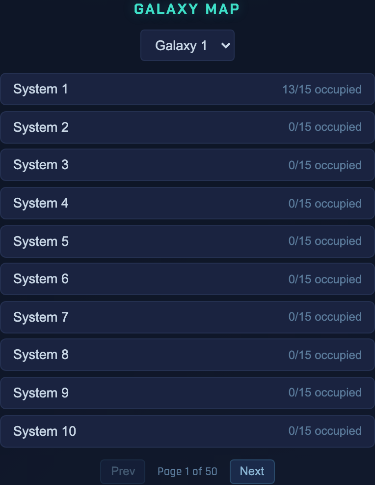
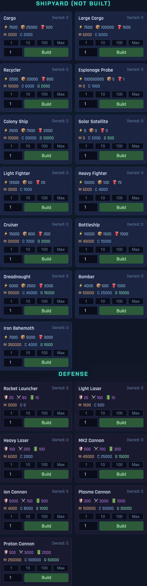

# 🌌 Galaxy Empire

> An OGame-inspired, real-time space-strategy MMO built as a **Go microservices** backend with a **Svelte** command-console frontend — the entire 20-container stack runs in **~110 MiB of RAM**.

<p align="center">
  
</p>

Colonize a homeworld, mine metal/crystal/gas, power it with solar and fusion, research technologies, build a shipyard and a fleet, scan and raid your neighbours across a 50-system galaxy, form alliances, and climb the rankings — all served by 18 independently-deployable Go services behind a single API gateway.

---

## ✨ Highlights

- **18 Go microservices** + Postgres + an Nginx-served SPA, orchestrated with Docker Compose.
- **Tiny footprint.** Each Go service idles at **2–5 MiB** RAM; the whole backend fits in the memory of a single bloated Node process.
- **API gateway** with JWT auth, per-route proxying, rate limiting, and SSE streaming for chat & notifications.
- **Deep gameplay**: planet economy, building queues, research tree, shipyard, defenses, fleet movement (dispatch/recall/split/merge), espionage, combat, moons, alliances, quests, events, and live chat.
- **Holographic HUD frontend** — a single Svelte app with a starship-console aesthetic.

---

## 🧠 Resource Footprint

The defining trait of this project is how *cheap* it is to run. A live `docker stats` of the full stack:

| Container       | Mem Usage | | Container        | Mem Usage |
|-----------------|-----------|-|------------------|-----------|
| gateway         | 1.77 MiB  | | research         | 3.23 MiB  |
| tutorial        | 1.94 MiB  | | event            | 3.98 MiB  |
| combat          | 2.00 MiB  | | alliance         | 4.36 MiB  |
| quest           | 2.03 MiB  | | friend           | 4.94 MiB  |
| planet          | 2.08 MiB  | | fleet            | 4.98 MiB  |
| espionage       | 2.15 MiB  | | admin            | 4.99 MiB  |
| nebula          | 2.23 MiB  | | ranking          | 5.00 MiB  |
| radar           | 2.41 MiB  | | notification     | 5.16 MiB  |
| auth            | 2.45 MiB  | | nginx (frontend) | 3.02 MiB  |
| chat            | 2.99 MiB  | | **postgres**     | **49.7 MiB** |

**~110 MiB total across 20 containers.** To keep it honest, every service is hard-capped in [docker-compose.yml](docker-compose.yml): **100 MiB per service, 300 MiB for Postgres**.



---

## 🏛️ Architecture

```
                    ┌─────────────┐
   Browser  ───────▶│   nginx     │   Svelte SPA (port 80)
                    └──────┬──────┘
                           │ /api/*
                    ┌──────▼──────┐
                    │   gateway   │   JWT auth · rate limit · proxy · SSE (8080)
                    └──────┬──────┘
        ┌──────────┬───────┼────────┬──────────┬───────────┐
        ▼          ▼       ▼        ▼          ▼           ▼
   ┌────────┐ ┌────────┐ ┌──────┐ ┌──────┐ ┌─────────┐ ┌──────────┐
   │  auth  │ │ planet │ │fleet │ │combat│ │espionage│ │ research │  …14 more
   └───┬────┘ └───┬────┘ └──┬───┘ └──┬───┘ └────┬────┘ └────┬─────┘
       └──────────┴─────────┴────────┴──────────┴───────────┘
                           │
                    ┌──────▼──────┐
                    │  postgres   │   one database, schema-per-service migrations
                    └─────────────┘
```

Every service is a standalone Go module (see [go.work](go.work)) with its own `main.go`, handlers, repository, and SQL migrations. Services talk to clients **only** through the gateway; a few talk to each other over internal HTTP endpoints (e.g. `fleet → planet` to deduct ships) secured with a shared internal secret.

### Services

| Service        | Port  | Responsibility |
|----------------|-------|----------------|
| `gateway`      | 8080  | Single public entrypoint — JWT validation, routing, rate limiting, SSE fan-out |
| `auth`         | 8081  | Registration, login, JWT issuance, vacation mode |
| `planet`       | 8082  | Planets, buildings, resources, galaxy map, shipyard, defenses, moons, gems |
| `fleet`        | 8083  | Fleet composition, dispatch, recall, split, merge, travel time |
| `combat`       | 8084  | Battle resolution between fleets & defenses |
| `research`     | 8085  | Technology tree and research queue |
| `espionage`    | 8086  | Spy probes and intelligence reports |
| `alliance`     | 8087  | Alliances, ranks, bank, bulletins, shared reports |
| `nebula`       | 8088  | Premium economy — Dark Matter, credits, commanders, store, daily tasks |
| `radar`        | 8089  | Incoming-fleet scanning and event detection |
| `chat`         | 8090  | Global chat + private messaging (SSE stream) |
| `friend`       | 8091  | Friends / buddy list |
| `ranking`      | 8092  | Player leaderboards |
| `notification` | 8093  | In-game notifications (SSE stream) |
| `quest`        | 8094  | Quest definitions, progress, rewards |
| `event`        | 8095  | Time-limited server events |
| `admin`        | 8096  | GM tools — resource grants, bans, GM messages, event creation |
| `tutorial`     | 8097  | New-player onboarding steps |

---

## 🛠️ Tech Stack

- **Backend:** Go 1.22, [chi](https://github.com/go-chi/chi) router, `database/sql` + Postgres, JWT, Go workspaces (`go.work`).
- **Database:** PostgreSQL 16, [golang-migrate](https://github.com/golang-migrate/migrate) numbered migrations per service.
- **Frontend:** Svelte 4 + Vite, served as static files by Nginx.
- **Infra:** Docker Compose, multi-stage Go & Node builds, GitHub Actions CI.

---

## 🚀 Quick Start

```bash
# Build and launch the entire stack (18 services + Postgres + frontend)
docker compose up -d --build

# Open the game
open http://localhost
```

That's it — the gateway, all services, the database (with seeded galaxy), and the frontend come up together. Register an account in the UI and you'll be dropped onto your **Homeworld**.

Handy [Makefile](Makefile) targets:

```bash
make up        # docker compose up -d
make down      # docker compose down
make logs      # follow all logs
make test      # go test across every service
make vet       # go vet across every service
make build     # compile every service
```

---

## 🎮 Gameplay

### Command your homeworld


Each player starts with a single **Terran** homeworld at coordinates `[galaxy:system:position]`. The dashboard is your command console:

- **Resources** — Metal, Crystal, Gas and Energy tick up in real time from your mines and power plants. Each resource bar shows the current stock, production rate, and storage cap.
- **Buildings** — Upgrade mines, storage, solar/fusion plants, robotics & nanite factories, terraformers and more. Higher levels cost more and consume more energy, so balance production against your power budget.
- **Status** — VIP level, rank, premium credits, and your Discoverer level are always in view.
- **Navigation** — the holographic tile grid jumps to every subsystem: Galaxy, Shipyard, Fleet, Moon, Alliance, Friends, Chat and Mail.

<br clear="right" />

### Explore the galaxy


The **Galaxy Map** spans multiple galaxies, each with **50 systems × 15 positions**. Browse systems to see which positions are occupied, scout targets, and pick destinations for your fleets. Occupancy is shown per system so you can quickly spot colonisation gaps and juicy targets.

<br clear="right" />

### Build a fleet & defenses


Once your **Shipyard** is built you can queue ships — from **Cargo** and **Recyclers** to **Light Fighters**, **Cruisers**, **Battleships**, **Dreadnoughts**, **Bombers**, and the colossal **Iron Behemoth**. Each ship lists its metal/crystal/gas cost and what you already own.

Below the shipyard, the **Defense** grid lets you fortify a planet with Rocket Launchers, Lasers, Ion and Plasma Cannons, and Proton Cannons to survive incoming raids.

<br clear="right" />

### Send fleets into the void

From the **Fleet** panel you assemble ships and **dispatch** them to a target — to attack, transport, colonise, or recycle debris. Fleets in flight can be **recalled**, **split**, or **merged**, and travel time depends on distance and your drive technology. The `radar` service warns you when hostile fleets are inbound.

### Go social & competitive

- **Alliances** — found or join an alliance with ranks, a shared bank, bulletins, and shared spy reports.
- **Chat & Mail** — a live global chat (server-sent events) and private messaging with inbox/outbox.
- **Friends, Rankings, Quests, Events** — a buddy list, leaderboards, reward-bearing quests, and time-limited server events keep the metagame moving.

---

## 🧩 Project Structure

```
.
├── cmd/                 # one directory == one Go microservice
│   ├── gateway/         #   API gateway (entrypoint)
│   ├── auth/  planet/  fleet/  combat/  ...
│   └── <service>/
│       ├── main.go          # routes + server bootstrap
│       ├── handler.go       # HTTP handlers
│       ├── service.go       # business logic
│       ├── repository.go    # Postgres access
│       └── migrations/      # numbered up/down SQL
├── game/                # Svelte + Vite frontend (served by nginx)
├── build/               # shared multi-stage Dockerfiles
├── docs/                # plans, specs, screenshots
├── scripts/             # tooling (e.g. Playwright screenshot capture)
├── docker-compose.yml   # the whole stack, with per-service memory caps
└── go.work              # Go workspace tying the services together
```

---

## 📸 Regenerating Screenshots

The screenshots in this README are captured automatically against a running stack with [Playwright](https://playwright.dev):

```bash
docker compose up -d --build           # stack must be running on :80
npm --prefix game install playwright   # browsers are bundled
cp scripts/screenshots.mjs game/ && (cd game && node screenshots.mjs) && rm game/screenshots.mjs
# images land in docs/screenshots/
```

---

## 📝 Notes

- This is a learning/portfolio project exploring microservice decomposition in Go — it favours clarity and independent deployability over premature optimisation.
- Default dev secrets (`JWT_SECRET`, `INTERNAL_SECRET`) live in `docker-compose.yml` and **must** be replaced before any non-local use.
